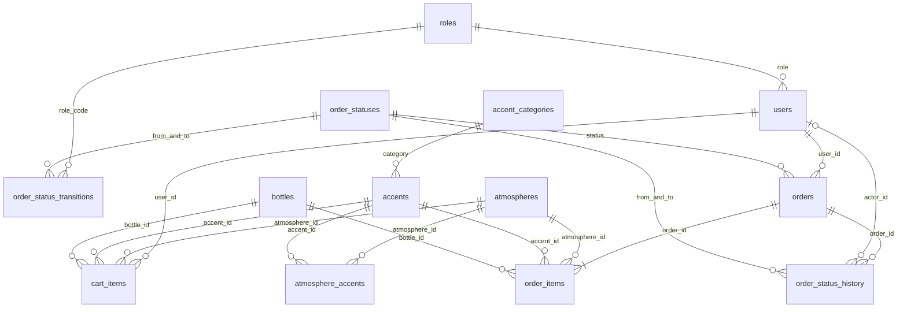

# Схема данных Fragrance

Актуальная структура — `schema.sql`. Последовательные изменения — `migrations/001`–`004`. Для установки: исходное наполнение `perfume_database.sql`, затем `npm run migrate`. Снимок структуры не содержит начальные справочники и отметки миграций; отдельно как готовую установку его не использовать.

## 15 таблиц

13 предметных: roles, users, accent_categories, atmospheres, accents, atmosphere_accents, bottles, cart_items, orders, order_items, order_statuses, order_status_transitions, order_status_history.

2 служебные: sessions (серверные сессии) и schema_migrations (выполненные SQL-шаги).

## Решения по хранению

- Роли и статусы имеют стабильные строковые коды, категории — уникальное имя. Внешние ключи запрещают неизвестные значения. Существующие строки категорий переносятся без переименования.
- Совместимость — связь многие-ко-многим с составным первичным ключом. Базовый аккорд остаётся JSON-массивом описательных нот, порядок элементов значим.
- Цена каталога — DECIMAL(10,2), суммы заказа — целые копейки BIGINT UNSIGNED. Валюта приложения BYN. Сервер проверяет безопасный диапазон целых JavaScript.
- Статус заказа хранится в orders для фильтрации, а история изменений — отдельными событиями. Допустимые переходы читаются из order_status_transitions. Изменение статуса и вставка события выполняются в одной транзакции с блокировкой заказа.
- actor_id хранит автора действия. Для перенесённых старых заказов автор неизвестен и равен NULL, event_kind=migration, время события — время переноса. Полная прежняя история не восстанавливается задним числом.
- Контакты получателя и позиции заказа являются снимком покупки. Они не зависят от последующего изменения профиля, названий и цен каталога.
- Заказы и их история защищены от каскадного удаления. Использованный товар скрывается через active. Только связи совместимости удаляются вместе с неиспользованным элементом каталога; корзина удаляется вместе с пользователем, если другие связи не запрещают удаление аккаунта.
- Уникальность (user_id, checkout_key) защищает от повторного оформления. Индексы orders(status, created_at), orders(created_at) и order_status_history(order_id, id) поддерживают фильтры и чтение журнала.
- sessions хранит JSON сессии и срок жизни; это отдельная техническая сущность, не таблица паролей. Пароли находятся только в users.password_hash в виде bcrypt-хешей.

История пишется приложением. Прямое ручное UPDATE orders в Workbench обходит бизнес-правила и журнал, поэтому обработку заказов нужно выполнять через API или панель.
